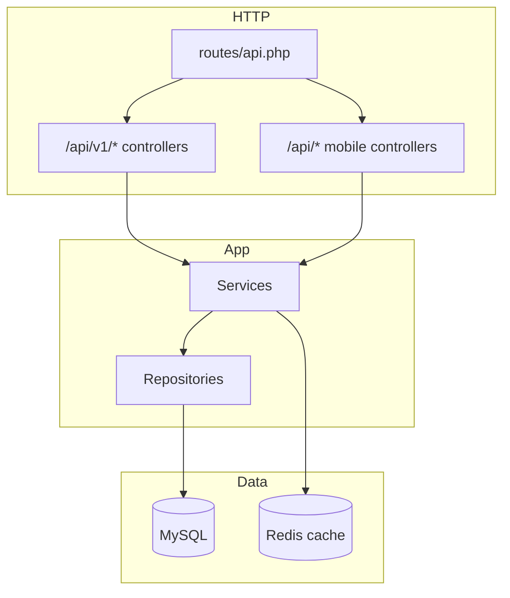

# Laravel Marketplace Platform API

[](https://github.com/sameh-bakleh/laravel-marketplace-platform/actions/workflows/ci.yml)


📓 [Changelog](CHANGELOG.md)

| | |
|---|---|
| **Repo** | [`laravel-marketplace-platform`](https://github.com/sameh-bakleh/laravel-marketplace-platform) |
| **Stack** | Laravel 13 · PHP 8.4 · JWT · MySQL · Redis · Docker · OpenAPI |
| **Mobile pairing** | [`ios-marketplace-product-app`](https://github.com/sameh-bakleh/ios-marketplace-product-app) |

**Production-style multi-vendor marketplace backend** — JWT auth, catalog, cart, checkout, orders, favorites, Redis listing cache, OpenAPI, Docker, PHPUnit, and an **iOS-ready mobile contract** for the SwiftUI portfolio client above.

> **30-second summary for recruiters:** Laravel REST API for a commerce marketplace with seller/admin roles, validated HTTP boundaries, repository-backed services, and automated tests. Ships two API surfaces: versioned `/api/v1/*` for full marketplace flows and unversioned `/api/*` endpoints matched to the SwiftUI portfolio client.

---

## Evaluate in 10 minutes

### Run with Docker

```bash
git clone https://github.com/sameh-bakleh/laravel-marketplace-platform.git
cd laravel-marketplace-platform
cp .env.example .env
docker compose up --build
```

The `app` container runs `composer install`, `php artisan key:generate`, `php artisan jwt:secret`, `php artisan migrate --force`, and `php artisan db:seed --force` on startup, then serves on port **8000**.

| URL | Purpose |
|-----|---------|
| `http://localhost:8000/api/v1` | Marketplace API (v1) |
| `http://localhost:8000/api/documentation` | Swagger UI (l5-swagger) |
| `http://localhost:8000/up` | Health check |

### Example requests

```bash
# Mobile login (iOS contract — seeded user)
curl -s -X POST http://localhost:8000/api/login \
  -H 'Content-Type: application/json' \
  -d '{"email":"demo@example.com","password":"password"}'

# Paginated catalog (Bearer token required)
curl -s -H "Authorization: Bearer YOUR_TOKEN" \
  'http://localhost:8000/api/products?per_page=5'

# Public v1 product list (no auth)
curl -s http://localhost:8000/api/v1/products | head
```

### API documentation

Swagger UI: **http://localhost:8000/api/documentation** (`php artisan l5-swagger:generate`). References: [`docs/API.md`](docs/API.md) · [`docs/MOBILE_CLIENT.md`](docs/MOBILE_CLIENT.md).

### Tests

```bash
composer install
php artisan test        # Marketplace + mobile client contract tests
vendor/bin/pint --test
```

---

## At a glance

| Question | Answer |
|----------|--------|
| **What is it?** | Multi-vendor marketplace API — auth, catalog, favorites, cart, checkout, orders, seller tools, admin categories. |
| **Why does it matter?** | Shows end-to-end backend ownership: JWT + RBAC, domain services, caching, migrations, Docker, CI, and a real mobile API contract. |
| **Mobile pairing** | [`ios-marketplace-product-app`](https://github.com/sameh-bakleh/ios-marketplace-product-app) — login, paginated catalog, favorites on `http://127.0.0.1:8000`. |
| **How do I run it?** | `docker compose up` or `php artisan serve` after migrate/seed — [Quick start](#quick-start) |
| **How do I test it?** | `php artisan test` — feature tests for marketplace + mobile client contract |

---

## Skills demonstrated

| Skill | Evidence |
|-------|----------|
| Laravel 13 / PHP 8.4 | `composer.json`, typed services/controllers |
| JWT authentication | Register, login, refresh, logout (`php-open-source-saver/jwt-auth`) |
| RBAC | `EnsureUserRole` middleware, seller/admin route groups |
| Repository + service layer | `app/Repositories/`, `app/Services/` |
| API Resources | Versioned resources + `Mobile/*` resources for iOS JSON shape |
| MySQL + Redis | Docker Compose; listing cache version bump on writes |
| OpenAPI | `l5-swagger` at `/api/documentation` |
| Docker + CI | `docker-compose.yml`, GitHub Actions (Pint + PHPUnit) |
| Mobile API contract | `/api/login`, `/api/products`, `/api/favorites` — [docs/MOBILE_CLIENT.md](docs/MOBILE_CLIENT.md) |

---

## Architecture overview



**Layering:** Controllers stay thin → Services own use cases → Repository interfaces → Eloquent models.

---

## API surfaces

| Surface | Base path | Used by |
|---------|-----------|---------|
| **Mobile client** | `/api/login`, `/api/products`, `/api/favorites` | iOS SwiftUI app (default `http://127.0.0.1:8000`) |
| **Marketplace v1** | `/api/v1/*` | Web/mobile clients, Swagger, integration tests |

Contract details: [docs/API.md](docs/API.md) · Mobile/iOS: [docs/MOBILE_CLIENT.md](docs/MOBILE_CLIENT.md)

---

## Quick start

See **[Evaluate in 10 minutes](#evaluate-in-10-minutes)** for the full Docker quickstart and `curl` examples.

### Docker (recommended)

```bash
cp .env.example .env
docker compose up --build
```

### Local (without Docker)

```bash
composer install
cp .env.example .env
php artisan key:generate
php artisan jwt:secret --force
php artisan migrate
php artisan demo:sync-product-images
php artisan db:seed
php artisan serve
```

### Demo logins (local only)

Password for all demo users: **`password`**

| Email | Role | Use for |
|-------|------|---------|
| `demo@example.com` | Buyer | **iOS app login** (3 pre-seeded favorites) |
| `buyer@marketplace.test` | Buyer | API exploration |
| `seller@marketplace.test` | Seller | Seller product CRUD |
| `admin@marketplace.test` | Admin | Category admin |

After `db:seed`, the catalog includes **24 published products** across 4 categories, each with a **local JPEG placeholder** served from `/demo/products/*.jpg` (run `php artisan demo:sync-product-images` once to download them).

---

## Pair with iOS app

1. Start this API on port **8000** (Docker or `php artisan serve`).
2. Run [`ios-marketplace-product-app`](https://github.com/sameh-bakleh/ios-marketplace-product-app) in the simulator.
3. Sign in with **`demo@example.com`** / **`password`**.

The iOS app defaults to `http://127.0.0.1:8000` — no URL override needed when using Docker or artisan on that port.

---

## Testing

```bash
composer install
php artisan test
./vendor/bin/pint --test
php artisan l5-swagger:generate
```

Feature coverage includes cart/checkout, seller/admin RBAC, and **`MobileClientApiTest`** (iOS JSON contract).

---

## Folder structure

```
laravel-marketplace-platform/
├── app/
│   ├── Http/Controllers/Api/
│   │   ├── Mobile/          # iOS contract (/api/login, /api/products, …)
│   │   └── V1/              # Full marketplace API
│   ├── Http/Resources/Mobile/
│   ├── Repositories/
│   └── Services/
├── database/migrations/
├── database/seeders/DemoMarketplaceSeeder.php
├── docs/
├── docker-compose.yml
├── routes/api.php
└── tests/Feature/
```

---

## Security & privacy

- **Portfolio sample only** — demo credentials, no production tenants.
- Secrets in `.env` and JWT keys — never commit real credentials.
- See [SECURITY.md](SECURITY.md).

---

## License

MIT — see [LICENSE](LICENSE).
